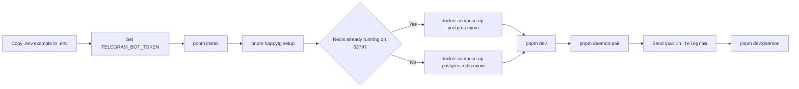

# HappyTG

HappyTG is a Telegram-first, Codex-first, self-hosted control plane for remotely operating AI coding sessions on a home machine or server.

It is designed around one hard constraint: Telegram is a render surface for commands, approvals, summaries, and notifications, but it is not the execution core and it is not the source of truth. The source of truth lives in the control plane state, durable event log, materialized views, and repo-local proof artifacts.

## First Start Flow



## Why HappyTG

- Remote control for local execution: operate coding work from Telegram while code runs on your own host.
- Codex-first workflow: optimize for Codex CLI, reproducible verification, repo-local task bundles, and project guidance.
- Proof in repo: non-trivial tasks use a durable proof loop with independent verification and evidence artifacts.
- Resume-first architecture: sessions, approvals, verification, and host connectivity survive disconnects and restarts.
- Self-hosted by default: designed for one developer on one machine first, without blocking future small-team deployment.

## Core Architecture

- `apps/api`: control plane API and websocket endpoints.
- `apps/worker`: event consumers, long-running orchestration, policy/approval processing.
- `apps/bot`: Telegram Bot render layer.
- `apps/miniapp`: Telegram Mini App render layer for diffs, bundles, logs, and reports.
- `apps/host-daemon`: local execution agent running on the developer host.
- `packages/protocol`: typed events, API contracts, daemon protocol, idempotency models.
- `packages/runtime-adapters`: Codex-first runtime orchestration and secondary runtime compatibility.
- `packages/repo-proof`: repo-local proof loop orchestration and task bundle helpers.
- `packages/bootstrap`: deterministic `doctor/setup/repair/verify` engine and manifests.
- `packages/policy-engine`: layered permissions and policy evaluation.
- `packages/approval-engine`: approval lifecycle and serialized mutation gates.
- `packages/hooks`: platform lifecycle hooks.
- `packages/shared`: shared types, logging, config, and utility helpers.

## Runtime Surfaces

| Surface | Default port | Purpose | Start command |
| --- | --- | --- | --- |
| Mini App | `3001` | Deep inspection for diffs, bundles, and reports | `pnpm dev:miniapp` |
| API | `4000` | Control plane HTTP/API surface | `pnpm dev:api` |
| Bot | `4100` | Telegram command and approval surface | `pnpm dev:bot` |
| Worker probe | `4200` | Worker health/probe surface | `pnpm dev:worker` |
| Host daemon | n/a | Local execution agent on the repo-owning host | `pnpm dev:daemon` |

## First-Run Signals

| Signal | Meaning | Next action |
| --- | --- | --- |
| `Codex CLI not found` | The current shell cannot resolve Codex at all. | Verify `codex --version`, then rerun `pnpm happytg doctor`. |
| `Codex: detected but unavailable` | The binary was found, but startup failed in this shell. | Run `codex --version` directly, fix the local install/runtime, then rerun `pnpm happytg doctor --json`. |
| `telegramConfigured: false` | Bot token is missing, placeholder, or invalid. | Set `TELEGRAM_BOT_TOKEN` in `.env`, then restart the bot. |
| `Host is not paired yet` | The daemon has not been paired with Telegram yet. | Run `pnpm daemon:pair`, send `/pair <CODE>`, then start `pnpm dev:daemon`. |

## Documentation Map

| Document | Use it when |
| --- | --- |
| [Architecture](./ARCHITECTURE.md) | You want the high-level system model and source-of-truth boundaries. |
| [Agent Guidance](./AGENTS.md) | You are contributing through Codex or Cursor and need repo rules. |
| [Engineering Blueprint](./docs/engineering-blueprint.md) | You need the full production-oriented design blueprint. |
| [Quickstart](./docs/quickstart.md) | You want the shortest path from clone to paired host. |
| [Installation](./docs/installation.md) | You need the complete local or self-hosted install path. |
| [Bootstrap Doctor](./docs/bootstrap-doctor.md) | You need to understand `setup`, `doctor`, `repair`, or `verify`. |
| [Runtime Codex](./docs/runtime-codex.md) | You want the Codex runtime model and execution expectations. |
| [Proof Loop](./docs/proof-loop.md) | You are running non-trivial work with repo-local proof artifacts. |
| [Release Process](./docs/release-process.md) | You need the guarded path for tags and GitHub Releases. |
| [Release Notes 0.2.0](./docs/releases/0.2.0.md) | You want the current release-level summary of onboarding/runtime changes. |
| [Docker Compose Example](./infra/docker-compose.example.yml) | You need the local shared infra compose file. |
| [Shared App Dockerfile](./infra/Dockerfile.app) | You need the reusable runtime image definition. |
| [CI Workflow](./.github/workflows/ci.yml) | You want the exact baseline verification gates enforced in CI. |

## Fast Start

1. Install Node.js 22+, `pnpm`, Git, and Codex CLI.
2. Create `.env`:

   ```bash
   cp .env.example .env
   ```

   PowerShell:

   ```powershell
   Copy-Item .env.example .env
   ```

3. Set `TELEGRAM_BOT_TOKEN` in `.env`.
4. Run the guided preflight:

   ```bash
   pnpm install
   pnpm happytg setup
   ```

5. Start shared infra. If Redis is already running on `localhost:6379`, reuse it and skip compose `redis`:

   ```bash
   docker compose -f infra/docker-compose.example.yml up postgres minio
   ```

   If Redis is not running yet:

   ```bash
   docker compose -f infra/docker-compose.example.yml up postgres redis minio
   ```

6. In a second shell, start the development stack:

   ```bash
   pnpm dev
   ```

7. In a third shell on the execution host, request pairing and then start the daemon:

   ```bash
   pnpm daemon:pair
   # send /pair <CODE> to the Telegram bot
   pnpm dev:daemon
   ```

8. If a port is already in use, override it explicitly. Example for the Mini App:

   ```bash
   HAPPYTG_MINIAPP_PORT=3002 pnpm dev:miniapp
   ```

   PowerShell:

   ```powershell
   $env:HAPPYTG_MINIAPP_PORT=3002; pnpm dev:miniapp
   ```

9. After pairing succeeds, run the first smoke task, then the first proof-loop task.

For the fuller path, use [Quickstart](./docs/quickstart.md), [Installation](./docs/installation.md), and [Bootstrap Doctor](./docs/bootstrap-doctor.md).

## Monorepo Commands

```bash
pnpm install
pnpm lint
pnpm typecheck
pnpm test
pnpm build
pnpm dev
pnpm happytg doctor
pnpm happytg verify
pnpm happytg task status --repo . --task HTG-0001
```

`pnpm happytg ...` is the repo-local CLI entrypoint. If you later install or publish the bootstrap package as a binary, the same commands are available as `happytg ...`.

## CI Baseline

The repository ships with a single verification workflow in [CI Workflow](./.github/workflows/ci.yml). Every branch under `codex/**`, plus `main`, runs the same baseline gates:

- `pnpm install --frozen-lockfile`
- `pnpm typecheck`
- `pnpm test`
- `pnpm build`

Any local self-hosted packaging or feature work should keep those commands green before it is considered merge-ready.

## Recommended Stack

HappyTG recommends a TypeScript-first monorepo:

- Node.js 22 LTS
- `pnpm` for the repository
- `npm` for global Codex CLI installation
- PostgreSQL for control-plane state
- Redis or NATS JetStream for queue/event fan-out
- S3-compatible object storage for larger artifacts
- Next.js for Mini App
- Fastify or Nest-like thin API layer backed by explicit domain services

## License

Apache-2.0.
