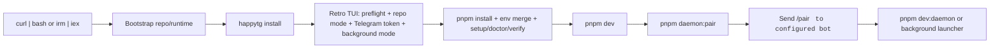

# HappyTG

HappyTG is a Telegram-first, Codex-first, self-hosted control plane for remotely operating AI coding sessions on a home machine or server.

It is designed around one hard constraint: Telegram is a render surface for commands, approvals, summaries, and notifications, but it is not the execution core and it is not the source of truth. The source of truth lives in the control plane state, durable event log, materialized views, and repo-local proof artifacts.

## Project Description

### English

HappyTG is a self-hosted control plane for developers who want to operate local AI coding sessions remotely without moving execution into a cloud-only agent. It connects a Telegram Bot and Telegram Mini App to a local control plane, worker, host daemon, runtime adapters, and repo-local proof system. The result is a workflow where a developer can start, inspect, approve, resume, and verify coding tasks from Telegram while the actual code execution stays on a trusted home machine, workstation, or server.

The project is intentionally Codex-first. Codex CLI and Codex Desktop are treated as the primary AI coding runtimes, and HappyTG adds the surrounding operational layer: session state, project discovery, runtime readiness checks, approval gates, policy evaluation, task evidence, and durable status projections. Telegram is used for fast control and notifications, while the Mini App provides the richer inspection surface for sessions, project history, diffs, proof bundles, logs, verification results, and Desktop task details.

HappyTG is built for local-first engineering discipline. Non-trivial work is expected to produce repo-local proof artifacts under `.agent/tasks/<TASK_ID>/`, including a frozen scope, raw command output, evidence, problems, and a final verdict. The control plane keeps durable state and event history, the worker performs orchestration, and the host daemon serializes mutating operations on the execution machine. This keeps the system resumable after disconnects, explicit about what was approved, and inspectable after a task finishes.

The system is useful when a developer wants to keep models, source code, credentials, and build tooling on their own infrastructure, but still wants a mobile-friendly operational surface. It is designed first for one developer controlling one or more local projects, with architecture boundaries that can grow toward small-team self-hosting: typed protocol contracts, policy and approval engines, separate render/control/execution planes, and repeatable bootstrap, doctor, verify, and release workflows.

HappyTG is not a replacement for Git, CI, or the underlying AI runtime. It is the coordination layer around them. It helps answer practical operational questions: which projects are available, which sessions are active, what changed, which action needs approval, whether verification passed, which Desktop task is running, and what evidence proves that a task is complete.

### Русский

HappyTG - это self-hosted control plane для разработчиков, которым нужно удалённо управлять локальными AI coding sessions, не перенося выполнение кода в cloud-only agent. Проект связывает Telegram Bot и Telegram Mini App с локальным control plane, worker, host daemon, runtime adapters и repo-local proof system. В результате разработчик может запускать, просматривать, подтверждать, возобновлять и проверять coding tasks из Telegram, а фактическое выполнение кода остаётся на доверенной домашней машине, рабочей станции или сервере.

Проект намеренно построен как Codex-first. Codex CLI и Codex Desktop рассматриваются как основные AI coding runtimes, а HappyTG добавляет операционный слой вокруг них: состояние сессий, discovery проектов, проверки готовности runtime, approval gates, policy evaluation, task evidence и durable status projections. Telegram используется для быстрого управления и уведомлений, а Mini App даёт более глубокий интерфейс для просмотра сессий, истории проектов, diffs, proof bundles, logs, результатов verification и деталей Desktop tasks.

HappyTG ориентирован на local-first engineering discipline. Для нетривиальных задач ожидаются repo-local proof artifacts в `.agent/tasks/<TASK_ID>/`: замороженный scope, raw command output, evidence, problems и final verdict. Control plane хранит durable state и event history, worker выполняет orchestration, а host daemon сериализует mutating operations на машине выполнения. Это делает систему resumable после disconnects, явно фиксирует approved actions и оставляет проверяемый след после завершения задачи.

Система полезна, когда разработчик хочет держать models, source code, credentials и build tooling на собственной инфраструктуре, но при этом иметь удобную мобильную поверхность управления. HappyTG сначала спроектирован для одного разработчика, который управляет одним или несколькими локальными проектами, но архитектурные границы позволяют расти в сторону small-team self-hosting: typed protocol contracts, policy и approval engines, разделённые render/control/execution planes, а также повторяемые bootstrap, doctor, verify и release workflows.

HappyTG не заменяет Git, CI или сам AI runtime. Это coordination layer вокруг них. Он помогает отвечать на практические операционные вопросы: какие проекты доступны, какие сессии активны, что изменилось, какое действие требует approval, прошла ли verification, какая Desktop task сейчас выполняется и какие evidence доказывают, что задача действительно завершена.

## One-Command Install



## Why HappyTG

- Remote control for local execution: operate coding work from Telegram while code runs on your own host.
- Codex-first workflow: optimize for Codex CLI, reproducible verification, repo-local task bundles, and project guidance.
- Proof in repo: non-trivial tasks use a durable proof loop with independent verification and evidence artifacts.
- Resume-first architecture: sessions, approvals, verification, and host connectivity survive disconnects and restarts.
- Self-hosted by default: designed for one developer on one machine first, without blocking future small-team deployment.

## Core Architecture

- `apps/api`: control plane API and websocket endpoints.
- `apps/worker`: event consumers, long-running orchestration, policy/approval processing.
- `apps/bot`: Telegram Bot render layer.
- `apps/miniapp`: Telegram Mini App render layer for diffs, bundles, logs, and reports.
- `apps/host-daemon`: local execution agent running on the developer host.
- `packages/protocol`: typed events, API contracts, daemon protocol, idempotency models.
- `packages/runtime-adapters`: Codex-first runtime orchestration and secondary runtime compatibility.
- `packages/repo-proof`: repo-local proof loop orchestration and task bundle helpers.
- `packages/bootstrap`: deterministic `doctor/setup/repair/verify` engine and manifests.
- `packages/policy-engine`: layered permissions and policy evaluation.
- `packages/approval-engine`: approval lifecycle and serialized mutation gates.
- `packages/hooks`: platform lifecycle hooks.
- `packages/shared`: shared types, logging, config, and utility helpers.

## Runtime Surfaces

| Surface | Default port | Purpose | Start command |
| --- | --- | --- | --- |
| Mini App | `3001` | Deep inspection for diffs, bundles, and reports | `pnpm dev:miniapp` |
| API | `4000` | Control plane HTTP/API surface | `pnpm dev:api` |
| Bot | `4100` | Telegram command and approval surface | `pnpm dev:bot` |
| Worker probe | `4200` | Worker health/probe surface | `pnpm dev:worker` |
| Host daemon | n/a | Local execution agent on the repo-owning host | `pnpm dev:daemon` |

## First-Run Signals

| Signal | Meaning | Next action |
| --- | --- | --- |
| `Codex CLI not found` | The current shell cannot resolve Codex at all. | Verify `codex --version`, then rerun `pnpm happytg doctor`. |
| `Codex: detected but unavailable` | The binary was found, but startup failed in this shell. | Run `codex --version` directly, fix the local install/runtime, then rerun `pnpm happytg doctor --json`. |
| `telegramConfigured: false` | Bot token is missing, placeholder, or invalid. | Set `TELEGRAM_BOT_TOKEN` in `.env`, then restart the bot. |
| `Host is not paired yet` | The daemon has not been paired with Telegram yet. | Run `pnpm daemon:pair`, send `/pair <CODE>`, then start `pnpm dev:daemon`. |

## Documentation Map

| Document | Use it when |
| --- | --- |
| [Architecture](./ARCHITECTURE.md) | You want the high-level system model and source-of-truth boundaries. |
| [Foundation Contracts](./docs/architecture/foundation-contracts.md) | You need the current canonical Wave 1 state, event, topology, and proof-bundle contracts. |
| [Agent Guidance](./AGENTS.md) | You are contributing through Codex or Cursor and need repo rules. |
| [Engineering Blueprint](./docs/engineering-blueprint.md) | You need the full production-oriented design blueprint. |
| [Quickstart](./docs/quickstart.md) | You want the shortest path from clone to paired host. |
| [Installation](./docs/installation.md) | You need the complete local or self-hosted install path. |
| [Bootstrap Doctor](./docs/bootstrap-doctor.md) | You need to understand `setup`, `doctor`, `repair`, or `verify`. |
| [Runtime Codex](./docs/runtime-codex.md) | You want the Codex runtime model and execution expectations. |
| [Proof Loop](./docs/proof-loop.md) | You are running non-trivial work with repo-local proof artifacts. |
| [Release Process](./docs/release-process.md) | You need the guarded path for tags and GitHub Releases. |
| [Release Notes 0.4.4](./docs/releases/0.4.4.md) | You want the current release-level summary of the Mini App public routing repair and bounded mobile UX redesign. |
| [Docker Compose Example](./infra/docker-compose.example.yml) | You need the local shared infra compose file. |
| [Shared App Dockerfile](./infra/Dockerfile.app) | You need the reusable runtime image definition. |
| [CI Workflow](./.github/workflows/ci.yml) | You want the exact baseline verification gates enforced in CI. |

## Fast Start

1. Bootstrap from a single command.

   macOS / Linux:

   ```bash
   curl -fsSL https://raw.githubusercontent.com/GermanMik/HappyTG/main/scripts/install/install.sh | bash
   ```

   Windows PowerShell:

   ```powershell
   irm https://raw.githubusercontent.com/GermanMik/HappyTG/main/scripts/install/install.ps1 | iex
   ```

2. The installer will:
   - detect platform, shell, package manager, and repo mode
   - ask for the Telegram bot token and save it into `.env`
   - resolve or explain Git, Node.js 22+, `pnpm`, Codex CLI, and optional Docker
   - ask whether to keep the local `pnpm dev` path, start packaged Docker Compose, print commands only, or skip startup
   - run `pnpm install`, merge `.env`, and offer `setup`, `doctor`, and `verify`
   - save the bot username when it can validate the token so later pairing tells you exactly which bot to message

3. For the default local path, start shared infra. If Redis is already running on `localhost:6379`, reuse it and skip compose `redis`:

   ```bash
   docker compose --env-file .env -f infra/docker-compose.example.yml up postgres minio
   ```

   If Redis is not running yet:

   ```bash
   docker compose --env-file .env -f infra/docker-compose.example.yml up postgres redis minio
   ```

4. In a second shell, start the development stack:

   ```bash
   pnpm dev
   ```

5. In a third shell on the execution host, request pairing and then start the daemon:

   ```bash
   pnpm daemon:pair
   # send /pair <CODE> to the configured Telegram bot
   pnpm dev:daemon
   ```

   If you selected installer launch mode `Docker Compose` instead, the installer runs:

   ```bash
   docker compose --env-file .env -f infra/docker-compose.example.yml up --build -d
   ```

   The Compose project name is stable as `happytg`, so containers are named like `happytg-api-1`. The installer still leaves `pnpm daemon:pair` plus the host daemon outside Compose.

6. If a port is already in use, override it explicitly. Example for the Mini App:

   ```bash
   HAPPYTG_MINIAPP_PORT=3002 pnpm dev:miniapp
   ```

   PowerShell:

   ```powershell
   $env:HAPPYTG_MINIAPP_PORT=3002; pnpm dev:miniapp
   ```

7. After pairing succeeds, run the first smoke task, then the first proof-loop task.

For the fuller path, use [Quickstart](./docs/quickstart.md), [Installation](./docs/installation.md), and [Bootstrap Doctor](./docs/bootstrap-doctor.md).

## Day-2 Update And Uninstall

For the easiest local update after GitHub changes, run the repo-local update wrapper from the existing checkout:

```bash
pnpm happytg update
```

For a clean checkout where you want the short manual path:

```bash
git status --short
git pull --ff-only
pnpm install
pnpm happytg doctor
pnpm happytg verify
```

After updating, restart the runtime you actually use: `pnpm dev` for local development, or `docker compose --env-file .env -f infra/docker-compose.example.yml up --build -d` for the packaged Compose stack.

To remove local HappyTG bootstrap/daemon artifacts without deleting the repo checkout or `.env`:

```bash
pnpm happytg uninstall
```

Stopping Docker services is separate:

```bash
docker compose --env-file .env -f infra/docker-compose.example.yml down
```

## Monorepo Commands

```bash
pnpm install
pnpm lint
pnpm typecheck
pnpm test
pnpm build
pnpm dev
pnpm happytg install
pnpm happytg install --launch-mode docker
pnpm happytg update
pnpm happytg doctor
pnpm happytg verify
pnpm happytg uninstall
pnpm happytg task status --repo . --task HTG-0001
```

`pnpm happytg ...` is the repo-local CLI entrypoint. If you later install or publish the bootstrap package as a binary, the same commands are available as `happytg ...`.

## CI Baseline

The repository ships with a single verification workflow in [CI Workflow](./.github/workflows/ci.yml). Every branch under `codex/**`, plus `main`, runs the same baseline gates:

- `pnpm install --frozen-lockfile`
- `pnpm typecheck`
- `pnpm test`
- `pnpm build`

Any local self-hosted packaging or feature work should keep those commands green before it is considered merge-ready.

## Recommended Stack

HappyTG recommends a TypeScript-first monorepo:

- Node.js 22 LTS
- `pnpm` for the repository
- `npm` for global Codex CLI installation
- PostgreSQL for control-plane state
- Redis or NATS JetStream for queue/event fan-out
- S3-compatible object storage for larger artifacts
- Next.js for Mini App
- Fastify or Nest-like thin API layer backed by explicit domain services

## License

Apache-2.0.
