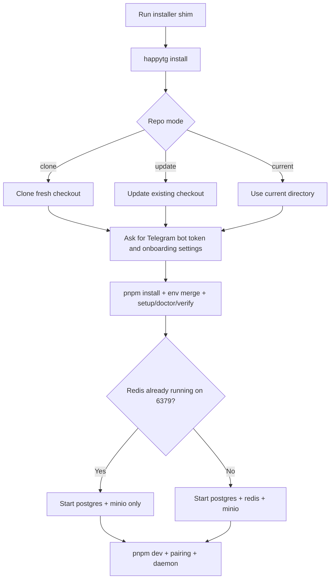

# Installation

Use [Quickstart](./quickstart.md) for the shortest path, [Bootstrap Doctor](./bootstrap-doctor.md) for the bootstrap state model, and [Self-Hosting](./self-hosting.md) when you are not using the local `pnpm dev` path.

## One-Command Path

HappyTG now installs through a single logical command:

macOS / Linux:

```bash
curl -fsSL https://raw.githubusercontent.com/GermanMik/HappyTG/main/scripts/install/install.sh | bash
```

Windows PowerShell:

```powershell
irm https://raw.githubusercontent.com/GermanMik/HappyTG/main/scripts/install/install.ps1 | iex
```

The shims only bootstrap Git / Node.js / `pnpm` enough to fetch the repo and hand off to the shared TypeScript installer inside `packages/bootstrap`.

## Prerequisites

- Git
- Node.js 22+
- `pnpm`
- `npm` for global Codex CLI installation
- Codex CLI installed globally: `npm install -g @openai/codex`
- Telegram bot token
- PostgreSQL, Redis, and S3-compatible object storage for local or self-hosted runs, either as existing services or via local Compose
- Docker and Docker Compose for the packaged control-plane path

## Install Decision Tree



## What The Installer Does

1. Detects OS, shell, package manager, terminal capability, and dependency state.
2. Lets you choose repo mode:
   - `clone fresh`
   - `update existing checkout`
   - `use current directory`
3. Handles dirty worktrees without overwriting local changes silently.
4. Installs or explains Git, Node.js 22+, `pnpm`, Codex CLI, and optional Docker/Desktop.
5. Runs `pnpm install`.
   If `pnpm install` reports ignored build scripts, the installer now validates the critical repo-local `tsx` + `esbuild` bootstrap path before it decides between warning-only continuation and install failure.
6. Merges `.env.example` into `.env` without losing existing values and creates a backup before edits.
7. Prompts for Telegram-first settings:
   - bot token
   - allowed user IDs
   - home channel
8. Validates the bot token when possible and stores `TELEGRAM_BOT_USERNAME` so later pairing instructions can point at the configured bot directly.
9. Offers a background daemon mode:
   - macOS: `LaunchAgent`, `manual`, `skip`
   - Windows: `Scheduled Task`, `Startup`, `manual`, `skip`
   - Linux: current service flow remains supported, plus installer-safe user-service/manual options
10. Can run `setup`, `doctor`, and `verify` in one unified flow.

When pnpm reports ignored build scripts, HappyTG does not silently suppress that state:

- if the repo-local `tsx` + `esbuild` health check passes, install continues with an explicit warning that the critical bootstrap path is still usable;
- if that health check fails, install stops with actionable, runtime-aware pnpm guidance instead of reporting a false success;
- the guidance is based on the pnpm capabilities that are actually available in the current shell, so HappyTG does not tell you to run `pnpm approve-builds` when that command is not exposed by the runtime pnpm.

## Local CLI Path

If the repo is already present, you can use the same flow directly:

```bash
pnpm happytg install
```

Useful flags:

```bash
pnpm happytg install --non-interactive --repo-mode current --telegram-bot-token <TOKEN> --allowed-user 123456789 --home-channel @team --post-check setup --post-check doctor
pnpm happytg install --json
```

## First Start

Run the first start in separate terminals so infra, pairing, and daemon startup stay explicit.

### Terminal 1: installer or shared infra

```bash
pnpm happytg install
```

If `DATABASE_URL`, `REDIS_URL`, and `S3_ENDPOINT` already point at reachable services, reuse them and skip Docker in this terminal.

If Redis is already running on `localhost:6379` and you still want local Compose for PostgreSQL plus MinIO:

```bash
docker compose -f infra/docker-compose.example.yml up postgres minio
```

If PostgreSQL, Redis, and MinIO are not already provided elsewhere:

```bash
docker compose -f infra/docker-compose.example.yml up postgres redis minio
```

### Terminal 2: repo services

```bash
pnpm dev
```

By default, the local repo path uses Telegram polling when `HAPPYTG_PUBLIC_URL` is local or otherwise not webhook-capable, so `/start` and `/pair <CODE>` do not require a public domain during local development.

Inline Mini App buttons in `/start` and `/menu` require a public HTTPS Mini App URL before Telegram will open them, but local polling and pairing do not. The persistent Telegram chat menu button is configured only when you explicitly run the menu command against a public deployment:

```bash
pnpm happytg telegram menu set --dry-run
pnpm happytg telegram menu set
```

The command prints the exact Mini App URL sent to Telegram and refuses unsafe URLs or an unreachable public Caddy `/miniapp` route. To reset Telegram's chat menu button:

```bash
pnpm happytg telegram menu reset
```

### Terminal 3: pairing and daemon

```bash
pnpm daemon:pair
# send /pair <CODE> to the configured Telegram bot
pnpm dev:daemon
```

### Important

- Do not run the full compose app stack and `pnpm dev` together on the same machine unless you intentionally changed the ports.
- If the bot logs `telegramConfigured: false`, rerun `pnpm happytg install` or set `TELEGRAM_BOT_TOKEN` in `.env`, then restart `pnpm dev:bot`.
- If the bot logs `Bot listening with degraded Telegram delivery`, inspect `http://127.0.0.1:4100/ready`. For local work, keep `TELEGRAM_UPDATES_MODE=auto` or set `TELEGRAM_UPDATES_MODE=polling`. For webhook mode, set a public HTTPS `HAPPYTG_PUBLIC_URL` and configure that webhook in Telegram.
- If pairing is not complete yet, the normal next step is always `pnpm daemon:pair` -> `/pair <CODE>` in Telegram -> `pnpm dev:daemon`.

## First-Run Checkpoints

| Checkpoint | Healthy result | If not healthy |
| --- | --- | --- |
| `pnpm happytg install` | Interactive one-command onboarding with repo sync and Telegram setup | Use `pnpm happytg doctor --json` for the detailed failure surface. |
| `pnpm happytg setup` | Short checklist with actionable next steps after install | Use `pnpm happytg doctor --json` for the detailed failure surface. |
| Bot startup | `Bot listening with Telegram polling active` for local dev, or `Bot listening with Telegram webhook active` for public webhook deployments | Fix `TELEGRAM_BOT_TOKEN` first; if delivery is degraded, inspect `GET /ready`, then choose `TELEGRAM_UPDATES_MODE=polling` for local dev or configure the expected public webhook. |
| Codex detection | `codex --version` works in the same shell | If not found, install/fix Codex; if found but doctor says unavailable, fix the shell/runtime and rerun doctor. |
| Pairing | `/pair <CODE>` succeeds in Telegram | Reissue `pnpm daemon:pair` if the code expired. |

## Redis and Port Decisions

HappyTG checks Redis state and critical ports during `pnpm happytg setup`, `pnpm happytg doctor`, and `pnpm happytg verify`.

Redis states:

- absent: no Redis executable was found and nothing answered on the configured port;
- installed but stopped: Redis binaries were found, but the configured port did not answer;
- running: Redis answered `PING` and can usually be reused directly.

If `6379` is already occupied:

- use the existing system Redis and skip compose `redis`;
- or change the compose host port with `HAPPYTG_REDIS_HOST_PORT`;
- or remove the published Redis port from the compose file if host access is unnecessary.

If `3001` is already occupied:

- if `pnpm happytg setup` says HappyTG Mini App is already running there, reuse it;
- if setup names another listener, treat that as a conflict rather than Mini App reuse;
- use `HAPPYTG_MINIAPP_PORT` or `PORT` to choose a different port manually;
- or free the existing listener and restart the Mini App.

If `4000` is already occupied:

- if `pnpm happytg setup` says HappyTG API is already running there, reuse it;
- if setup names another listener, treat that as a conflict rather than API reuse;
- use `HAPPYTG_API_PORT` or `PORT` to choose a different port manually;
- or free the existing listener and restart the API.

During interactive `pnpm happytg install`, HappyTG now runs the same planned-port preflight before later startup guidance. For each real conflict it shows the occupied port, the detected listener when available, the nearest 3 free ports, and an explicit choice to save one `HAPPYTG_*_PORT` override into `.env`, enter a custom port, or abort.

PowerShell examples:

```powershell
$env:HAPPYTG_MINIAPP_PORT=3002; pnpm dev:miniapp
$env:HAPPYTG_API_PORT=4001; pnpm dev:api
$env:HAPPYTG_REDIS_HOST_PORT=6380; docker compose -f infra/docker-compose.example.yml up redis
```

## Developer Install

1. Run `pnpm happytg install` if you have not already completed the one-command flow.
2. Reuse existing PostgreSQL / Redis / S3-compatible services through `DATABASE_URL`, `REDIS_URL`, and `S3_ENDPOINT`, or start local infrastructure:

   ```bash
   docker compose -f infra/docker-compose.example.yml up postgres redis minio
   ```

3. In a separate terminal, run the monorepo in watch mode:

   ```bash
   pnpm dev
   ```

4. Run the host daemon on the machine that owns the workspace and Codex install:

   ```bash
   pnpm daemon:pair
   # send /pair <CODE> to the Telegram bot
   pnpm dev:daemon
   ```

5. Open Telegram, complete pairing, then run a quick session followed by a proof-loop session.
6. Use the repo-local CLI when you need deterministic bootstrap or task-bundle actions:

   ```bash
   pnpm happytg status
   pnpm happytg task init --repo . --task HTG-0001 --session ses_manual --workspace ws_manual --title "Manual proof task" --criterion "criterion one"
   pnpm happytg task validate --repo . --task HTG-0001
   ```

7. Validate the local baseline before any change lands:

   ```bash
   pnpm typecheck
   pnpm test
   pnpm build
   ```

## Single-User Self-Hosted Install

1. Provision one control-plane host and one or more execution hosts.
2. On the control-plane host, run `pnpm happytg install` or manually copy `.env.example` to `.env` and set production secrets and storage endpoints.
3. Start the packaged compose stack without `pnpm dev`:

   ```bash
   docker compose -f infra/docker-compose.example.yml up --build -d
   ```

4. Put a reverse proxy with TLS in front of the API and Mini App.
5. For `happytg.gerta.crazedns.ru`, expose `/miniapp`, the allowed public Mini App API routes, and `/telegram/webhook` through Caddy, then verify the public URL you will send to Telegram.
6. Configure the persistent Telegram menu button:

   ```bash
   pnpm happytg telegram menu set --dry-run
   pnpm happytg telegram menu set
   ```

7. On each execution host, install Codex CLI and run `pnpm happytg setup`.
8. Request pairing on the execution host:

   ```bash
   pnpm daemon:pair
   ```

9. Pair execution hosts through Telegram with `/pair <CODE>`.
10. Start the host daemon outside the Compose stack on the execution host:

   ```bash
   pnpm --filter @happytg/host-daemon run
   ```

11. Run `pnpm happytg verify` and then execute a Codex smoke session.

## Required Config

- Telegram token and webhook secret
- database and Redis URLs
- artifact storage settings
- JWT signing key
- Codex binary path and config path
- public API and Mini App URLs for Telegram callbacks
- public HTTPS Mini App URL for `setChatMenuButton`, usually `HAPPYTG_MINIAPP_URL`
- service-specific port overrides such as `HAPPYTG_MINIAPP_PORT`, `HAPPYTG_API_PORT`, `HAPPYTG_BOT_PORT`, `HAPPYTG_WORKER_PORT`, and `HAPPYTG_REDIS_HOST_PORT` when defaults conflict

## Notes

- [Shared App Dockerfile](../infra/Dockerfile.app) is the shared runtime image for `apps/api`, `apps/worker`, `apps/bot`, and `apps/miniapp`.
- The host daemon is intentionally excluded from Docker Compose because it must run where the target repositories and local Codex configuration live.
- The CI baseline in [CI Workflow](../.github/workflows/ci.yml) matches the expected local verification gates.
- `pnpm happytg ...` is the repo-local wrapper around the same CLI surface exposed as `happytg ...` when installed as a binary.
- `pnpm happytg install` is the primary onboarding path; `pnpm happytg setup` remains the short checklist; `pnpm happytg doctor --json` and `pnpm happytg verify --json` remain the detailed diagnostics paths.
