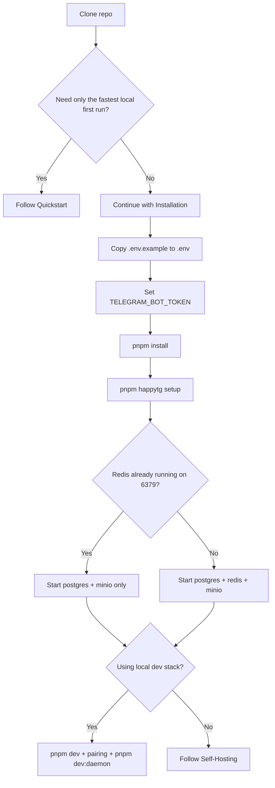

# Installation

Use [Quickstart](./quickstart.md) for the shortest path, [Bootstrap Doctor](./bootstrap-doctor.md) for the bootstrap state model, and [Self-Hosting](./self-hosting.md) when you are not using the local `pnpm dev` path.

## Prerequisites

- Git
- Node.js 22+
- `pnpm`
- `npm` for global Codex CLI installation
- Codex CLI installed globally: `npm install -g @openai/codex`
- Telegram bot token
- PostgreSQL, Redis, and S3-compatible object storage for local or self-hosted runs
- Docker and Docker Compose for the packaged control-plane path

## Install Decision Tree



## Before You Start

1. Clone the repository.
2. Create `.env` from `.env.example`.

   ```bash
   cp .env.example .env
   ```

   PowerShell:

   ```powershell
   Copy-Item .env.example .env
   ```

3. Set a real `TELEGRAM_BOT_TOKEN` in `.env`. HappyTG no longer assumes you edited `.env` correctly ahead of time; `pnpm happytg setup` will stop and tell you if the token is missing or obviously invalid.
4. Run `pnpm install`.
5. Run `pnpm happytg setup` on the execution host that will run Codex.
6. Use `pnpm happytg doctor --json` or `pnpm happytg verify --json` only when you need the detailed diagnostics.

## First Start

Run the first start in separate terminals so infra, pairing, and daemon startup stay explicit.

### Terminal 1: guided preflight and shared infra

```bash
pnpm install
pnpm happytg setup
```

If Redis is already running on `localhost:6379`, reuse it:

```bash
docker compose -f infra/docker-compose.example.yml up postgres minio
```

If Redis is missing or stopped:

```bash
docker compose -f infra/docker-compose.example.yml up postgres redis minio
```

### Terminal 2: repo services

```bash
pnpm dev
```

### Terminal 3: pairing and daemon

```bash
pnpm daemon:pair
# send /pair <CODE> to the Telegram bot
pnpm dev:daemon
```

### Important

- Do not run the full compose app stack and `pnpm dev` together on the same machine unless you intentionally changed the ports.
- If the bot logs `telegramConfigured: false`, set `TELEGRAM_BOT_TOKEN` in `.env` and restart `pnpm dev:bot`.
- If pairing is not complete yet, the normal next step is always `pnpm daemon:pair` -> `/pair <CODE>` in Telegram -> `pnpm dev:daemon`.

## First-Run Checkpoints

| Checkpoint | Healthy result | If not healthy |
| --- | --- | --- |
| `pnpm happytg setup` | Short checklist with actionable next steps | Use `pnpm happytg doctor --json` for the detailed failure surface. |
| Bot startup | `Bot listening` with `telegramConfigured: true` | Set or fix `TELEGRAM_BOT_TOKEN` in `.env`, then restart the bot. |
| Codex detection | `codex --version` works in the same shell | If not found, install/fix Codex; if found but doctor says unavailable, fix the shell/runtime and rerun doctor. |
| Pairing | `/pair <CODE>` succeeds in Telegram | Reissue `pnpm daemon:pair` if the code expired. |

## Redis and Port Decisions

HappyTG checks Redis state and critical ports during `pnpm happytg setup`, `pnpm happytg doctor`, and `pnpm happytg verify`.

Redis states:

- absent: no Redis executable was found and nothing answered on the configured port;
- installed but stopped: Redis binaries were found, but the configured port did not answer;
- running: Redis answered `PING` and can usually be reused directly.

If `6379` is already occupied:

- use the existing system Redis and skip compose `redis`;
- or change the compose host port with `HAPPYTG_REDIS_HOST_PORT`;
- or remove the published Redis port from the compose file if host access is unnecessary.

If `3001` is already occupied:

- reuse the already-running HappyTG Mini App if it is yours;
- or pick a new `HAPPYTG_MINIAPP_PORT`;
- or free the existing process and restart the Mini App.

PowerShell examples:

```powershell
$env:HAPPYTG_MINIAPP_PORT=3002; pnpm dev:miniapp
$env:HAPPYTG_API_PORT=4001; pnpm dev:api
$env:HAPPYTG_REDIS_HOST_PORT=6380; docker compose -f infra/docker-compose.example.yml up redis
```

## Developer Install

1. Start local infrastructure:

   ```bash
   docker compose -f infra/docker-compose.example.yml up postgres redis minio
   ```

2. In a separate terminal, run the monorepo in watch mode:

   ```bash
   pnpm dev
   ```

3. Run the host daemon on the machine that owns the workspace and Codex install:

   ```bash
   pnpm daemon:pair
   # send /pair <CODE> to the Telegram bot
   pnpm dev:daemon
   ```

4. Open Telegram, complete pairing, then run a quick session followed by a proof-loop session.
5. Use the repo-local CLI when you need deterministic bootstrap or task-bundle actions:

   ```bash
   pnpm happytg status
   pnpm happytg task init --repo . --task HTG-0001 --session ses_manual --workspace ws_manual --title "Manual proof task" --criterion "criterion one"
   pnpm happytg task validate --repo . --task HTG-0001
   ```

6. Validate the local baseline before any change lands:

   ```bash
   pnpm typecheck
   pnpm test
   pnpm build
   ```

## Single-User Self-Hosted Install

1. Provision one control-plane host and one or more execution hosts.
2. On the control-plane host, copy `.env.example` to `.env` and set production secrets and storage endpoints.
3. Start the packaged compose stack without `pnpm dev`:

   ```bash
   docker compose -f infra/docker-compose.example.yml up --build -d
   ```

4. Put a reverse proxy with TLS in front of the API and Mini App.
5. On each execution host, install Codex CLI and run `pnpm happytg setup`.
6. Request pairing on the execution host:

   ```bash
   pnpm daemon:pair
   ```

7. Pair execution hosts through Telegram with `/pair <CODE>`.
8. Start the host daemon outside the Compose stack on the execution host:

   ```bash
   pnpm --filter @happytg/host-daemon run
   ```

9. Run `pnpm happytg verify` and then execute a Codex smoke session.

## Required Config

- Telegram token and webhook secret
- database and Redis URLs
- artifact storage settings
- JWT signing key
- Codex binary path and config path
- public API and Mini App URLs for Telegram callbacks
- service-specific port overrides such as `HAPPYTG_MINIAPP_PORT`, `HAPPYTG_API_PORT`, `HAPPYTG_BOT_PORT`, `HAPPYTG_WORKER_PORT`, and `HAPPYTG_REDIS_HOST_PORT` when defaults conflict

## Notes

- [Shared App Dockerfile](../infra/Dockerfile.app) is the shared runtime image for `apps/api`, `apps/worker`, `apps/bot`, and `apps/miniapp`.
- The host daemon is intentionally excluded from Docker Compose because it must run where the target repositories and local Codex configuration live.
- The CI baseline in [CI Workflow](../.github/workflows/ci.yml) matches the expected local verification gates.
- `pnpm happytg ...` is the repo-local wrapper around the same CLI surface exposed as `happytg ...` when installed as a binary.
- `pnpm happytg setup` is the short first-run path; `pnpm happytg doctor --json` and `pnpm happytg verify --json` are the detailed diagnostics paths.
