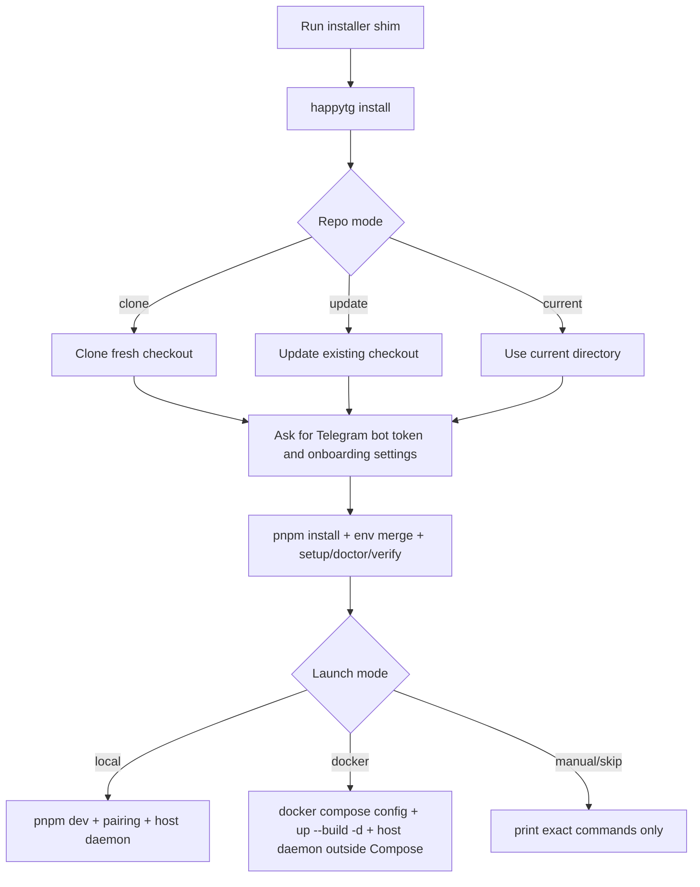

# Installation

Use [Quickstart](./quickstart.md) for the shortest path, [Bootstrap Doctor](./bootstrap-doctor.md) for the bootstrap state model, and [Self-Hosting](./self-hosting.md) when you are not using the local `pnpm dev` path.

## One-Command Path

HappyTG now installs through a single logical command:

macOS / Linux:

```bash
curl -fsSL https://raw.githubusercontent.com/GermanMik/HappyTG/main/scripts/install/install.sh | bash
```

Windows PowerShell:

```powershell
irm https://raw.githubusercontent.com/GermanMik/HappyTG/main/scripts/install/install.ps1 | iex
```

The shims only bootstrap Git / Node.js / `pnpm` enough to fetch the repo and hand off to the shared TypeScript installer inside `packages/bootstrap`.

## Prerequisites

- Git
- Node.js 22+
- `pnpm`
- `npm` for global Codex CLI installation
- Codex CLI installed globally: `npm install -g @openai/codex`
- Telegram bot token
- PostgreSQL, Redis, and S3-compatible object storage for local or self-hosted runs, either as existing services or via local Compose
- Docker and Docker Compose for the packaged control-plane path

## Install Decision Tree



## What The Installer Does

1. Detects OS, shell, package manager, terminal capability, and dependency state.
2. Lets you choose repo mode:
   - `clone fresh`
   - `update existing checkout`
   - `use current directory`
3. Handles dirty worktrees without overwriting local changes silently.
4. Installs or explains Git, Node.js 22+, `pnpm`, Codex CLI, and optional Docker/Desktop.
5. Runs `pnpm install`.
   If `pnpm install` reports ignored build scripts, the installer now validates the critical repo-local `tsx` + `esbuild` bootstrap path before it decides between warning-only continuation and install failure.
6. Merges `.env.example` into `.env` without losing existing values and creates a backup before edits.
7. If the selected repo already has Telegram values in `.env`, shows them first on an explicit reuse/edit confirmation screen. Bot tokens are masked; allowed IDs, home channel, and bot username are shown only there instead of silently filling the edit form.
8. Prompts for Telegram-first settings when values are not explicitly reused:
   - bot token
   - allowed user IDs
   - home channel
9. Validates the bot token when possible and stores `TELEGRAM_BOT_USERNAME` so later pairing instructions can point at the configured bot directly.
10. Offers a launch mode for the control-plane stack:
   - `local`: do not start containers; final guidance uses `pnpm dev`
   - `docker`: validate and start `docker compose --env-file .env -f infra/docker-compose.example.yml up --build -d`
   - `manual`: do not start anything; print exact local and Docker commands
   - `skip`: no startup action beyond install and selected post-checks
11. Offers a host daemon startup mode:
   - macOS: `LaunchAgent`, `manual`, `skip`
   - Windows: `Scheduled Task`, `Startup`, `manual`, `skip`
   - Linux: current service flow remains supported, plus installer-safe user-service/manual options
12. Can run `setup`, `doctor`, and `verify` in one unified flow.

Docker Compose uses the stable project name `happytg`; a clean Docker launch creates container names such as `happytg-api-1`, `happytg-bot-1`, and `happytg-miniapp-1`. The host daemon remains outside Compose.

In Docker launch mode, the installer asks whether to run an isolated HappyTG-owned Docker stack or reuse existing system Redis/Postgres/MinIO/Caddy services. Reuse mode starts only the app/observability services with `docker compose ... up --build -d --no-deps ...`, passes container-reachable `COMPOSE_REDIS_URL`, `COMPOSE_DATABASE_URL`, and `COMPOSE_S3_ENDPOINT`, and does not create duplicate `redis`, `postgres`, `minio`, or reused `caddy` containers. For system Caddy, the default action is to generate a snippet under HappyTG local state; patching an operator-owned Caddyfile is interactive-only, requires a second confirmation, writes a backup, validates before reload, and touches only a marked HappyTG block.

When pnpm reports ignored build scripts, HappyTG does not silently suppress that state:

- if the repo-local `tsx` + `esbuild` health check passes, install continues with an explicit warning that the critical bootstrap path is still usable;
- if that health check fails, install stops with actionable, runtime-aware pnpm guidance instead of reporting a false success;
- the guidance is based on the pnpm capabilities that are actually available in the current shell, so HappyTG does not tell you to run `pnpm approve-builds` when that command is not exposed by the runtime pnpm.

## Local CLI Path

If the repo is already present, you can use the same flow directly:

```bash
pnpm happytg install
```

Useful flags:

```bash
pnpm happytg install --non-interactive --repo-mode current --telegram-bot-token <TOKEN> --allowed-user 123456789 --home-channel @team --post-check setup --post-check doctor
pnpm happytg install --non-interactive --repo-mode current --launch-mode docker --telegram-bot-token <TOKEN>
pnpm happytg install --non-interactive --repo-mode current --launch-mode docker --docker-services reuse --docker-caddy print-snippet --telegram-bot-token <TOKEN>
pnpm happytg install --json
```

## Updating An Existing Install

Use this path when GitHub has newer HappyTG changes and the repo already exists on the machine.

The easiest update is the repo-local installer:

```bash
pnpm happytg install
pnpm happytg verify
```

This preserves the current installation shape: local `pnpm dev`, Docker isolated stack, Docker service reuse, self-hosted control plane, or execution-host daemon setup. It also keeps `.env` merge behavior and post-check choices in one flow.

For a clean checkout where you want the shortest manual path:

```bash
git status --short
git pull --ff-only
pnpm install
pnpm happytg doctor
pnpm happytg verify
```

If local changes exist, commit or stash them before the manual path, or rerun `pnpm happytg install` and choose the installer dirty-worktree handling.

Restart only the runtime you use after the update:

```bash
pnpm dev
```

For Docker isolated mode:

```bash
docker compose --env-file .env -f infra/docker-compose.example.yml up --build -d
docker compose --env-file .env -f infra/docker-compose.example.yml ps
```

For Docker reuse mode, keep reused Redis/Postgres/MinIO/Caddy operator-owned and rerun with explicit reuse when you want the installer to refresh app services without duplicate infra:

```bash
pnpm happytg install --launch-mode docker --docker-services reuse
```

Local cleanup commands:

```bash
pnpm happytg uninstall
pnpm bootstrap:uninstall
```

`pnpm happytg uninstall` removes installer-owned local HappyTG artifacts from `HAPPYTG_STATE_DIR` or `~/.happytg`, including daemon state/journal, install drafts and reports, installer logs/backups, the default bootstrap checkout, and installer-managed background launchers. The installer now resets stale HappyTG-owned launchers before applying the newly selected host-daemon startup mode, so selecting `manual` or `skip` removes old Windows Scheduled Task/Startup artifacts for the safe state scope. The command keeps the repo checkout, `.env`, Docker Compose services, volumes, and remote control-plane data by default.

Stopping packaged Docker services is separate from local uninstall:

```bash
docker compose --env-file .env -f infra/docker-compose.example.yml down
```

Removing Docker volumes or deleting the repo checkout is destructive and should be done only as a separate explicit operator action.

## First Start

Run the first start in separate terminals so control-plane startup, pairing, and host-daemon startup stay explicit.

`pnpm happytg install` now asks how to launch the control-plane stack after setup:

- `Local dev` keeps the existing `pnpm dev` path and does not touch Docker.
- `Docker Compose` validates `infra/docker-compose.example.yml`, starts the packaged stack, and still leaves the host daemon on the host.
- `Manual` prints the exact commands without starting anything.
- `Skip` stops after install plus any selected post-checks.

In non-interactive mode the default remains `local`; Docker starts only with `--launch-mode docker`.

### Terminal 1: installer or shared infra

```bash
pnpm happytg install
```

For a packaged control-plane start directly from the installer:

```bash
pnpm happytg install --launch-mode docker
```

If `DATABASE_URL`, `REDIS_URL`, and `S3_ENDPOINT` already point at reachable services, choose Docker reuse mode during the installer or pass `--docker-services reuse`. Docker will not start duplicate Redis/Postgres/MinIO containers in that mode. If you want a completely isolated stack, choose the isolated Docker option and let the installer remap busy host ports.

If Redis is already running on `localhost:6379` and you still want local Compose for PostgreSQL plus MinIO:

```bash
docker compose --env-file .env -f infra/docker-compose.example.yml up postgres minio
```

If PostgreSQL, Redis, and MinIO are not already provided elsewhere:

```bash
docker compose --env-file .env -f infra/docker-compose.example.yml up postgres redis minio
```

### Terminal 2: repo services

```bash
pnpm dev
```

Do not run the full `pnpm dev` stack on the same default ports as `--launch-mode docker`. Choose one control-plane startup path per host unless you intentionally remap the relevant `HAPPYTG_*_PORT` values first.

After a successful Docker launch, the installer reports Compose as already started and prints day-2 commands:

```bash
docker compose --env-file .env -f infra/docker-compose.example.yml ps
docker compose --env-file .env -f infra/docker-compose.example.yml logs -f
docker compose --env-file .env -f infra/docker-compose.example.yml up --build -d
docker compose --env-file .env -f infra/docker-compose.example.yml down
```

The host daemon is still separate from Docker. If `Scheduled Task`, `Startup`, `LaunchAgent`, or `systemd user service` was configured, it starts on the next login/session according to that launcher; run `pnpm dev:daemon` only if you need it immediately. If `manual` or `skip` was selected, start it manually with `pnpm dev:daemon` when host operations are needed.

By default, the local repo path uses Telegram polling when `HAPPYTG_PUBLIC_URL` is local or otherwise not webhook-capable, so `/start` and `/pair <CODE>` do not require a public domain during local development.

Inline Mini App buttons in `/start` and `/menu` require a public HTTPS Mini App URL before Telegram will open them, but local polling and pairing do not. The persistent Telegram chat menu button is configured only when you explicitly run the menu command against a public deployment:

```bash
pnpm happytg telegram menu set --dry-run
pnpm happytg telegram menu set
```

The command prints the exact Mini App URL sent to Telegram and refuses unsafe URLs or an unreachable public Caddy `/miniapp` route. To reset Telegram's chat menu button:

```bash
pnpm happytg telegram menu reset
```

### Terminal 3: pairing and daemon

```bash
pnpm daemon:pair
# send /pair <CODE> to the configured Telegram bot
pnpm dev:daemon
```

Even after `--launch-mode docker`, the host daemon stays outside Compose because it needs direct access to local repositories and Codex configuration.

### Important

- Do not run the full compose app stack and `pnpm dev` together on the same machine unless you intentionally changed the ports.
- If the bot logs `telegramConfigured: false`, rerun `pnpm happytg install` or set `TELEGRAM_BOT_TOKEN` in `.env`, then restart `pnpm dev:bot`.
- If the bot logs `Bot listening with degraded Telegram delivery`, inspect `http://127.0.0.1:4100/ready`. For local work, keep `TELEGRAM_UPDATES_MODE=auto` or set `TELEGRAM_UPDATES_MODE=polling`. For webhook mode, set a public HTTPS `HAPPYTG_PUBLIC_URL` and configure that webhook in Telegram.
- If pairing is not complete yet, the normal next step is always `pnpm daemon:pair` -> `/pair <CODE>` in Telegram -> `pnpm dev:daemon`.

## Uninstall / Cleanup

Use uninstall on developer machines or external execution hosts when you want to remove local HappyTG bootstrap/runtime artifacts without deleting the repo checkout:

```bash
pnpm happytg uninstall
```

Scope:

- removes local daemon state and journal under `HAPPYTG_STATE_DIR` or `~/.happytg`
- removes install drafts, bootstrap reports, logs, backups, and the default `bootstrap-repo`
- removes installer-managed background launchers such as LaunchAgent, Scheduled Task, Startup shortcut, or systemd user unit when they were recorded for the current local state scope
- for repeated installs in the same local state scope, removes all recorded background artifacts, not just the latest background mode
- keeps the repo checkout and `.env` in place by design
- keeps Docker Compose services, volumes, database/object storage state, and remote control-plane data untouched

Packaged control plane / external daemon split:

- on execution hosts, run `pnpm happytg uninstall` to remove the external daemon bootstrap/runtime state
- on the control-plane host, stop the packaged stack separately with `docker compose -f infra/docker-compose.example.yml down`
- if you intentionally want to delete persistent Compose volumes or the repo checkout itself, do that as a separate explicit operator step

## First-Run Checkpoints

| Checkpoint | Healthy result | If not healthy |
| --- | --- | --- |
| `pnpm happytg install` | Interactive one-command onboarding with repo sync and Telegram setup | Use `pnpm happytg doctor --json` for the detailed failure surface. |
| `pnpm happytg setup` | Short checklist with actionable next steps after install | Use `pnpm happytg doctor --json` for the detailed failure surface. |
| Bot startup | `Bot listening with Telegram polling active` for local dev, or `Bot listening with Telegram webhook active` for public webhook deployments | Fix `TELEGRAM_BOT_TOKEN` first; if delivery is degraded, inspect `GET /ready`, then choose `TELEGRAM_UPDATES_MODE=polling` for local dev or configure the expected public webhook. |
| Codex detection | `codex --version` works in the same shell | If not found, install/fix Codex; if found but doctor says unavailable, fix the shell/runtime and rerun doctor. |
| Pairing | `/pair <CODE>` succeeds in Telegram | Reissue `pnpm daemon:pair` if the code expired. |

## Redis and Port Decisions

HappyTG checks Redis state and critical ports during `pnpm happytg setup`, `pnpm happytg doctor`, and `pnpm happytg verify`.

Redis states:

- absent: no Redis executable was found and nothing answered on the configured port;
- installed but stopped: Redis binaries were found, but the configured port did not answer;
- running: Redis answered `PING` and can usually be reused directly.

If `6379` is already occupied:

- use the existing system Redis and skip compose `redis`;
- or change the compose host port with `HAPPYTG_REDIS_HOST_PORT`;
- or remove the published Redis port from the compose file if host access is unnecessary.

If `3001` is already occupied:

- if `pnpm happytg setup` says HappyTG Mini App is already running there, reuse it;
- if setup names another listener, treat that as a conflict rather than Mini App reuse;
- use `HAPPYTG_MINIAPP_PORT` or `PORT` to choose a different port manually;
- or free the existing listener and restart the Mini App.

When you choose a non-default Mini App port such as `3007`, keep the local URL settings on the same port:

```env
HAPPYTG_MINIAPP_PORT=3007
HAPPYTG_APP_URL=http://localhost:3007
HAPPYTG_DEV_CORS_ORIGINS=http://localhost:3007,http://127.0.0.1:3007
```

With this local setup, `HAPPYTG_PUBLIC_URL=http://localhost:4000` can remain the API/bot URL. `pnpm dev`, doctor, and `/ready` may report Mini App launch buttons as disabled because Telegram requires public HTTPS, but they should reference the Mini App listener on `3007` rather than the API port `4000`; polling and pairing still work.

If Caddy runs directly on the host, point it at the same listener with `HAPPYTG_MINIAPP_UPSTREAM=127.0.0.1:3007`. If Caddy runs through `infra/docker-compose.example.yml`, leave `HAPPYTG_MINIAPP_UPSTREAM` unset; compose maps the host port to the Mini App container's internal `3001`.

If `4000` is already occupied:

- if `pnpm happytg setup` says HappyTG API is already running there, reuse it;
- if setup names another listener, treat that as a conflict rather than API reuse;
- use `HAPPYTG_API_PORT` or `PORT` to choose a different port manually;
- or free the existing listener and restart the API.

During interactive `pnpm happytg install`, HappyTG now runs the same planned-port preflight before later startup guidance. For each real conflict it shows the occupied port, the detected listener when available, the nearest 3 free ports, and an explicit choice to save one `HAPPYTG_*_PORT` override into `.env`, enter a custom port, or abort.

PowerShell examples:

```powershell
$env:HAPPYTG_MINIAPP_PORT=3002; pnpm dev:miniapp
$env:HAPPYTG_API_PORT=4001; pnpm dev:api
$env:HAPPYTG_REDIS_HOST_PORT=6380; docker compose --env-file .env -f infra/docker-compose.example.yml up redis
```

## Developer Install

1. Run `pnpm happytg install` if you have not already completed the one-command flow.
2. Reuse existing PostgreSQL / Redis / S3-compatible services through `DATABASE_URL`, `REDIS_URL`, and `S3_ENDPOINT`, or start local infrastructure:

   ```bash
   docker compose --env-file .env -f infra/docker-compose.example.yml up postgres redis minio
   ```

3. In a separate terminal, run the monorepo in watch mode:

   ```bash
   pnpm dev
   ```

4. Run the host daemon on the machine that owns the workspace and Codex install:

   ```bash
   pnpm daemon:pair
   # send /pair <CODE> to the Telegram bot
   pnpm dev:daemon
   ```

5. Open Telegram, complete pairing, then run a quick session followed by a proof-loop session.
6. Use the repo-local CLI when you need deterministic bootstrap or task-bundle actions:

   ```bash
   pnpm happytg status
   pnpm happytg task init --repo . --task HTG-0001 --session ses_manual --workspace ws_manual --title "Manual proof task" --criterion "criterion one"
   pnpm happytg task validate --repo . --task HTG-0001
   ```

7. Validate the local baseline before any change lands:

   ```bash
   pnpm typecheck
   pnpm test
   pnpm build
   ```

## Single-User Self-Hosted Install

1. Provision one control-plane host and one or more execution hosts.
2. On the control-plane host, run `pnpm happytg install` or manually copy `.env.example` to `.env` and set production secrets and storage endpoints.
3. Start the packaged compose stack without `pnpm dev`:

   ```bash
   docker compose --env-file .env -f infra/docker-compose.example.yml up --build -d
   ```

   Compose uses project name `happytg`, so `docker compose ps` and `docker ps` show names like `happytg-api-1`.

4. Put a reverse proxy with TLS in front of the API and Mini App.
5. For `happytg.gerta.crazedns.ru`, expose `/miniapp`, the allowed public Mini App API routes, and `/telegram/webhook` through Caddy, then verify the public URL you will send to Telegram.
6. Configure the persistent Telegram menu button:

   ```bash
   pnpm happytg telegram menu set --dry-run
   pnpm happytg telegram menu set
   ```

7. On each execution host, install Codex CLI and run `pnpm happytg setup`.
8. Request pairing on the execution host:

   ```bash
   pnpm daemon:pair
   ```

9. Pair execution hosts through Telegram with `/pair <CODE>`.
10. Start the host daemon outside the Compose stack on the execution host:

   ```bash
   pnpm --filter @happytg/host-daemon run
   ```

11. Run `pnpm happytg verify` and then execute a Codex smoke session.

## Required Config

- Telegram token and webhook secret
- database and Redis URLs
- artifact storage settings
- JWT signing key
- Codex binary path and config path
- public API and Mini App URLs for Telegram callbacks
- public HTTPS Mini App URL for `setChatMenuButton`, usually `HAPPYTG_MINIAPP_URL`
- service-specific port overrides such as `HAPPYTG_MINIAPP_PORT`, `HAPPYTG_API_PORT`, `HAPPYTG_BOT_PORT`, `HAPPYTG_WORKER_PORT`, and `HAPPYTG_REDIS_HOST_PORT` when defaults conflict

## Notes

- [Shared App Dockerfile](../infra/Dockerfile.app) is the shared runtime image for `apps/api`, `apps/worker`, `apps/bot`, and `apps/miniapp`.
- The host daemon is intentionally excluded from Docker Compose because it must run where the target repositories and local Codex configuration live.
- The CI baseline in [CI Workflow](../.github/workflows/ci.yml) matches the expected local verification gates.
- `pnpm happytg ...` is the repo-local wrapper around the same CLI surface exposed as `happytg ...` when installed as a binary.
- `pnpm happytg install` is the primary onboarding path; `pnpm happytg setup` remains the short checklist; `pnpm happytg doctor --json` and `pnpm happytg verify --json` remain the detailed diagnostics paths.
